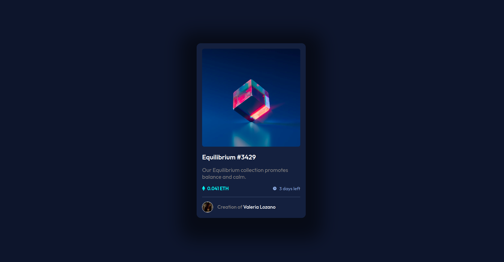
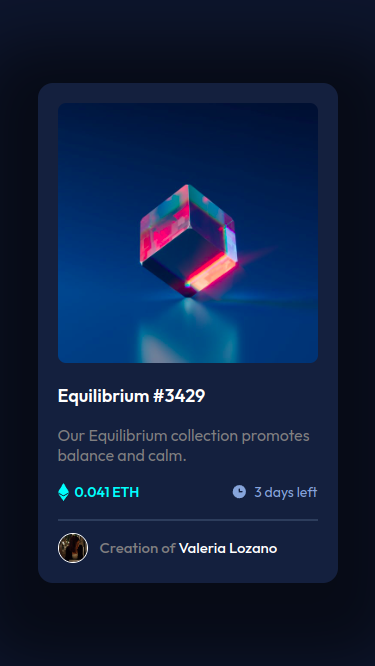

# Make It Real - NAME OF THE PROJECT

This is a solution to the '**404 not found**' project of the Make It Real course.

## Table of contents

- [Overview](#overview)
  - [The challenge](#the-challenge)
  - [Expected result](#expected-result)
- [Actual result](#actual-result)
- [My process](#my-process)
  - [Built with](#built-with)
  - [What I learned](#what-i-learned)
  - [Continued development](#continued-development)
  - [Useful resources](#useful-resources)
- [Author](#author)
- [Acknowledgments](#acknowledgments)

## Overview

### The challenge

- Design a '**NFT preview card**' page
- The page should be responsive
- Consider at least two devices:
  - Mobile: 375px
  - Desktop: 1440px

### Expected result

## Actual result

- Desktop
   
  
   

- Nest Hub Max
   
  
   

- iPad Mini & iPhone SE
   
  
  

## My process

### Built with

- Semantic HTML5 markup
- CSS custom properties
- CSS media queries
- Flexbox
- Desktop-first workflow

### What I learned

Nothing in particular.

### Continued development

Practicing responsiveness, especially regarding font sizes, is something I still haven't mastered and it takes up a lot of time during development.

### Useful resources

- [Color Picker](https://snapcraft.io/color-picker) - It helped me to get a more accurate representation of the colors that were not provided.
- [Google Fonts](https://fonts.google.com/) - It provided the main font used in the project.
- [Optimizilla](https://imagecompressor.com/) - To optimize the screenshots.

## Author

Valeria Lozano _a.k.a._ **Bubbl33s**

- [GitHub](https://www.your-site.com)
- [Codepen](https://codepen.io/Bubbl33s)

## Acknowledgments

- Make it Real mentors
- Brave AI-generated answer
- Linus Torlalds
- Rick Astley
